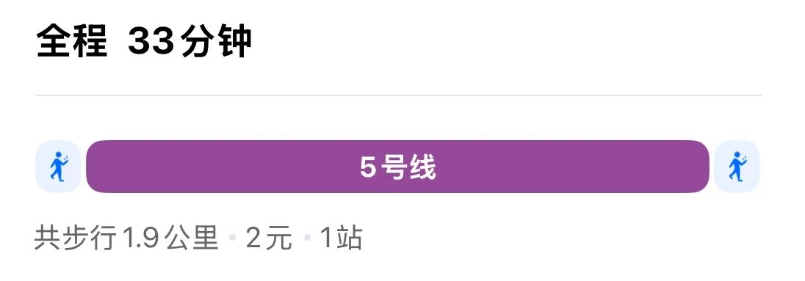
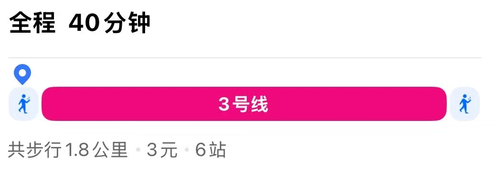

### **行程总览（3.4-3.11）**
**路线调整**：成都（3天）→ 都江堰（1天）→ 重庆（3天）  
**交通衔接**：成都东站→重庆北站（高铁1.5小时），重庆江北机场返宁波  
**核心亮点**：成都人文+熊猫基地→重庆魔幻夜景+山城文化  

---

### **每日行程安排**
#### **Day 1（3.4）：宁波→成都，夜游初体验**  
- **21:05**：抵达成都天府机场 → 做地铁至瑶多多民宿
  

- **23:00后**：街边夜游 `50元`
- **住宿**：<a href="http://dpurl.cn/D70RKdCz">瑶多多民宿</a>
> 人均预算 : ***61元***  

---

#### **Day 2（3.5）：熊猫基地+武侯祠**
- **上午**：<a href="https://sub6591331.c.jkxds.net/panda/index">成都大熊猫繁育研究基地</a>（入园时间：8：00-12：00）`55元`

- **午餐**：<a href="https://m.dianping.com/shopshare/laO8gFTojHrPqKfT?msource=Appshare2021&utm_source=shop_share&shoptype=10&shopcategoryid=4467&cityid=8&isoversea=0">永乐饭店</a> `62元`
 

- **下午**：<a href="https://cdwhcm.ktmtech.cn/index">武侯祠</a> （入园时间：13：00-17：00）`50元`
 

- **晚餐**：<a href="https://m.dianping.com/shopshare/G71qoMOjAY9a8xvw?msource=Appshare2021&utm_source=shop_share&shoptype=10&shopcategoryid=32733&cityid=8&isoversea=0">翠孃孃老火锅</a> `92元`
 

- **傍晚**：春熙路/太古里商区 
> 人均预算 : ***275元***  
---

#### **Day 3（3.6）：都江堰一日游**
- **7:30**：高铁犀浦站→都江堰站（30分钟，票价10元） 
- **12:00**午餐：基地内简餐或自带零食  
- **下午**：都江堰景区（秦堰楼俯瞰全景→鱼嘴→安澜桥→飞沙堰） 
- **19:30** 王朋友 鸡毛店  
> 人均预算 : ***61元***  
---

#### **Day 4（3.7）：成都→重庆，山城初印象**
- **上午**：三星堆 成都东站寄存 
- **12:30** 盐城人家  
- **15:00** 去重庆
- **傍晚**：白象居（老居民楼拍长江索道穿楼） → 湖广会馆（黄墙古建筑）  
- **夜晚**：千厮门大桥拍洪崖洞全景 → 火锅选**瓜西西火锅**（洪崖洞店，微辣配冰汤圆）  
> 人均预算 : ***61元***  
---

#### **Day 5（3.8）：重庆魔幻8D深度游**
- **上午**：李子坝轻轨穿楼（A出口观景台） → 鹅岭二厂（文创园区+天台拍照）  
- **下午**：磁器口古镇（尝陈麻花、鸡杂锅） → 渣滓洞/白公馆（可选红色教育）  
- **傍晚**：长江索道（南站→北站，避开晚高峰）  
- **夜晚**：南山一棵树观景台（渝中半岛夜景） → 夜宵**老甘家小龙虾**（蒜蓉味+拌面）  
> 人均预算 : ***61元***  
---

#### **Day 6（3.9）：重庆周边自然/文化游（二选一）**
- **方案A（自然风光）**：武隆天生三桥（高铁至武隆站+大巴，往返约5小时，喀斯特地貌）  
- **方案B（人文历史）**：大足石刻（高铁至大足南站+公交，往返约4小时，佛教石刻艺术）  
- **返程**：18:00前回重庆，晚餐推荐**渝宗老灶火锅**（本地人常去）  
> 人均预算 : ***61元***  
---

#### **Day 7（3.10）：重庆自由活动+返程准备**
- **上午**：山城步道（悬空栈道看江景） → 朝天门码头（来福士商场内观景台）  
- **12:00** 退房并寄存行李 → 午餐**晓彭肥肠鸡**（居民楼老店，芋儿超糯）  
- **13:30** 出发去重庆江北机场（地铁3号线约50分钟，或打车30分钟）  
- **15:50** 航班返回宁波  
> 人均预算 : ***61元***  
---

### **关键时间节点提醒**
1. **成都→重庆高铁**：务必提前3天购票（3.7日车票需3.4日开抢），推荐靠窗座位赏川渝风光。  
2. **重庆江北机场值机**：预留至少1.5小时（重庆机场安检较严，3.10日需13:30前抵达机场）。  
3. **景点预约**：  
   - 武侯祠（门票50元，公众号预约）  
   - 南山一棵树（门票30元，现场购票）  
   - 都江堰（门票80元，携程可买当日票）  
> 人均预算 : ***61元***  
---

### **预算微调（人均）**
- **交通**：成都重庆高铁154元 + 市内交通约200元  
- **住宿**：成都3晚600元（经济型） + 重庆3晚600元  
- **餐饮**：800元（含火锅3顿+小吃）  
- **门票**：300元（都江堰+武侯祠+南山一棵树）  
- **总计**：约2500元（不含宁波往返机票）  

---

### **宁波出发专属建议**
1. **行李精简**：3月川渝气温10-20℃，建议带防风外套+薄毛衣+运动鞋（重庆爬坡多）。  
2. **辣度适应**：成都火锅蘸料可加醋解辣，重庆火锅建议直接选微辣。  
3. **特产采购**：  
   - 重庆：桥头火锅底料（超市购买更便宜）  
   - 成都：双流兔头（真空包装）  
   - 对比宁波：可带油焖笋分享给川渝朋友  

如需进一步细化某日行程或推荐具体餐厅，可随时告知！祝你们玩得尽兴，记得多拍洪崖洞夜景~ 🌃
---

